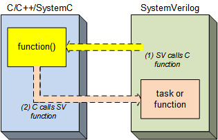
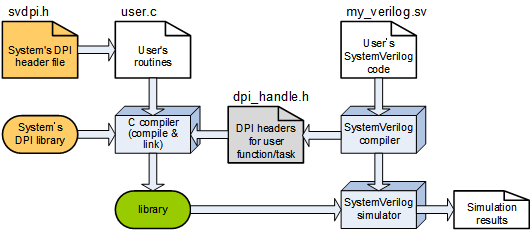
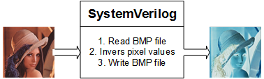
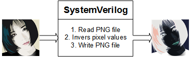

# Tutorial on DPI (Direct Programming Interface)
This <a href="https://github.com/adki/DPI_Tutorial" target="_blank">repository</a>
contains tutorial and reference codes of DPI (*Direct Programming Interface*). 
All contents are provided as it is WITHOUT ANY WARRANTY and NO TECHNICAL SUPPORT will be provided for problems
that might arise.

---
# Overview
DPI allows SystemVerilog-HDL code to invoke C functions and vice versa.

|  |
|:---:|
| *DPI concepts* |

Picture below shows a rough flow to use DPI.

|  |
|:---:|
| *DPI flow* |

## Prerequisites
This example uses Xilinx Vivado simulator, i.e., xsim.

## Example codes

* **01_simple_sv2c**                SystemVerilog calls C function that has no return value.
* **02_simple_sv2c_return**         SystemVerilog calls C function that has return value.
* **03_simple_sv2c_array_input**    SystemVerilog calls C function that has array argument (to C).
* **04_simple_sv2c_array_output**   SystemVerilog calls C function that has array argument (from C).
* **05_simple_sv2c_struct_input**   SystemVerilog calls C function that has struct argument (to C).
* **06_simple_sv2c_struct_output**  SystemVerilog calls C function that has struct argument (from C).
* **50_simple_c2sv_function**       C calls SystemVerilog function
* **51_simple_c2sv_task**           C calls SystemVerilog task (not yet)

## Example projects

* **prj_bmp** 
SystemVerilog calls routines to handle BMP file and it uses
<a href="https://github.com/adki/BmpHandle" target="_blank">BMP handle C library</a>.

|  |
|:---:|
| *BMP handle project* |

* **prj_png** 
SystemVerilog calls routines to handle PNG file and it uses
<a href="https://stb.handmade.network" target="_blank">STB (single-file header-file) libraries for C/C++</a>.

|  |
|:---:|
| *PNG handle project* |

---
### Acknowledgment
This work was prepared for the lectures 
in KAIST IDEC, ETRI SW-SoC Academy, several Universities and institutes, and so on.

### Authors and contributors
* **[Ando Ki]** - *Initial work* - <a href="http://www.future-ds.com" target="_blank">Future Design Systems</a>

### License
This contents and its associated materials are licensed with
the 2-clause BSD license to make the program and library useful in open and
closed source products independent of their licensing scheme.
Each contributor holds copyright over their respective contribution.

The 2-Clause BSD License

Copyright 2020-2021 Future Design Systems (http:://www.future-ds.com)

Redistribution and use in source and binary forms, with or without modification, are permitted provided that the following conditions are met:

1. Redistributions of source code must retain the above copyright notice, this list of conditions and the following disclaimer.

2. Redistributions in binary form must reproduce the above copyright notice, this list of conditions and the following disclaimer in the documentation and/or other materials provided with the distribution.

THIS SOFTWARE IS PROVIDED BY THE COPYRIGHT HOLDERS AND CONTRIBUTORS "AS IS" AND ANY EXPRESS OR IMPLIED WARRANTIES, INCLUDING, BUT NOT LIMITED TO, THE IMPLIED WARRANTIES OF MERCHANTABILITY AND FITNESS FOR A PARTICULAR PURPOSE ARE DISCLAIMED. IN NO EVENT SHALL THE COPYRIGHT HOLDER OR CONTRIBUTORS BE LIABLE FOR ANY DIRECT, INDIRECT, INCIDENTAL, SPECIAL, EXEMPLARY, OR CONSEQUENTIAL DAMAGES (INCLUDING, BUT NOT LIMITED TO, PROCUREMENT OF SUBSTITUTE GOODS OR SERVICES; LOSS OF USE, DATA, OR PROFITS; OR BUSINESS INTERRUPTION) HOWEVER CAUSED AND ON ANY THEORY OF LIABILITY, WHETHER IN CONTRACT, STRICT LIABILITY, OR TORT (INCLUDING NEGLIGENCE OR OTHERWISE) ARISING IN ANY WAY OUT OF THE USE OF THIS SOFTWARE, EVEN IF ADVISED OF THE POSSIBILITY OF SUCH DAMAGE.

### Revision history
* 2021.01.02: Released by Ando Ki
* 2020: Started by Ando Ki (adki(at)future-ds.com)
